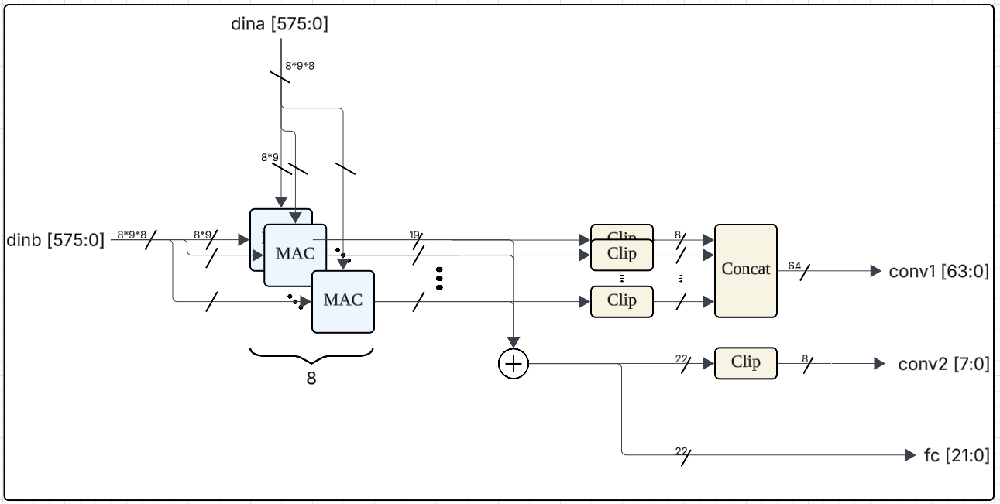

# CNN-FPGA-Accelerator
**FPGA-Based Accelerator for MNIST Classifier (CNN Architecture)**

This project implements a Convolutional Neural Network (CNN) on an FPGA to classify handwritten digits from the MNIST dataset.  
The goal is to accelerate inference using custom RTL hardware optimized for minimal latency.  
Rather than focusing on batch processing, our primary target was to minimize the **latency of a single image classification** among the 10,000 MNIST test images.

---

## 🎯 Target Model Architecture

We implemented a lightweight CNN tailored for FPGA deployment.  
The model structure is as follows:

  

To run the model efficiently on FPGA, we used fixed-point arithmetic with an 8-bit representation.  
All intermediate and output values were stored using 8 bits.

To fit values into this limited precision:
- We discarded the lower bits after multiplication to reduce the bit-width.
- Then, we applied clamping to keep the values within the valid 8-bit range.

The diagram below illustrates how this fixed-point quantization process works:

  

---

## 📊 Computational Analysis

In this section, we break down the computation cost per layer in terms of:
- Number of **Multiply-Accumulate (MAC)** operations
- Number of **input memory (IMEM)** and **weight memory (WMEM)** accesses

This analysis justifies our decision to adopt different dataflow models:
- **Weight Stationary** vs **Input Stationary** strategies

|           Layer           | Convolution 1 | Convolution 2 | Max Pooling | Fully Connected |
|---------------------------|---------------|---------------|-------------|-----------------|
| IMEM Access               | 784           | 5408          | 9216        | 2304            |
| WMEM Access               | 72            | 1152          | -           | 23040           |
| MAC Operations            | 48672         | 663552        | -           | 23040           |
| Dataflow Strategy         | Weight Stationary | Weight Stationary | - | Output Stationary |

---

## 🧩 Hardware Architecture

> *(Suggested title: “Our Custom RTL Architecture” or “Processing Element-Based Hardware Design”)*

Our design leverages a **PE (Processing Element)-based architecture**, where MAC units are reused across convolution and FC layers.

<!-- PE + MAC diagram side-by-side -->

  
  

<i>Left: PE Structure Diagram | Right: MAC Layout</i>

hello

  

hi

  
  

Each layer performs operations as follows:
- **Convolution 1**: Streaming data into PEs with weight reuse

  

- **Convolution 2**: Streaming data into PEs with weight reuse

  

- **Fully Connected**: Executed using the same PE array in time-multiplexed fashion

  

We also carefully designed **BRAM access patterns** to optimize performance.

| Memory Module | Size (KB) | Purpose                      |
|---------------|-----------|------------------------------|
| BRAM 1        | 16        | Input Feature Maps           |
| BRAM 2        | 32        | Weights                      |
| BRAM 3        | 8         | Intermediate/Output Buffers  |

---

## 🔍 Results & Analysis

After full synthesis and implementation on the FPGA board:

  
  

  

---

## 🔭 Future Work & Extensions

We explored model compression techniques including:
- **Quantization**: down to 4-bit and 2-bit versions  
  We verified the accuracy by comparing against a **Python-based inference (Jupyter Notebook)**.  
  Our 4-bit quantized model retained **~97% accuracy** on MNIST.
- **PE sharing** for further area reduction
- Support for **larger datasets (e.g., CIFAR-10)**

  

  

---

## 🛠️ Technologies Used

- Verilog HDL (RTL)
- Xilinx Vivado
- Python (model design, validation)
- Jupyter Notebook (evaluation, visualization)
